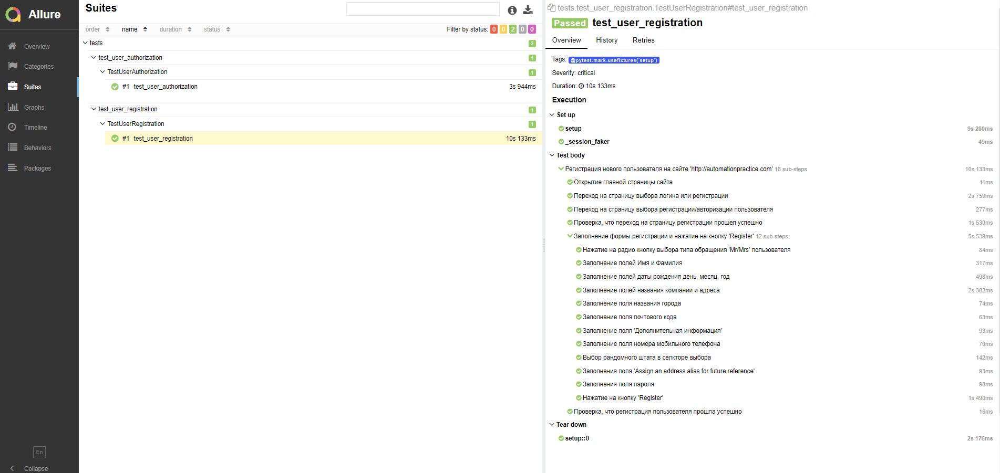
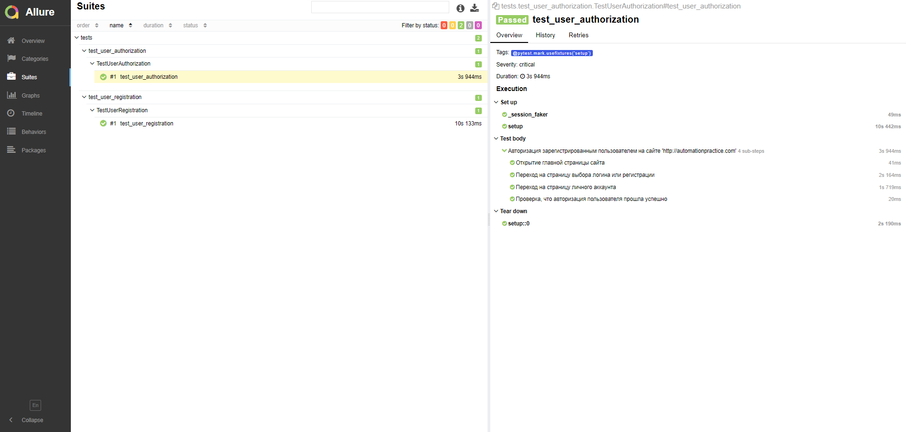

# Установка виртуального окружения и зависимостей:

Выполнить в терминале в главном каталоге проекта (или в терминаме PyCharm):
- Добавить виртуальное окружение: **python -m venv venv**
- Активировать окружение: **venv\Scripts\activate.bat**
- Установить все зависимости: **pip install -r requirements.txt**

# Запуск:

**pytest ru.sqvr/tests --url=Имя площадки --alluredir=ru.sqvr/allure_results**

**Пример:** 
py.test --browser_name chrome -v -s test_user_authorization.py --alluredir [путь до папки с проектом]\ru.sqvr\allure_results
cd [путь до папки с проектом]\ru.sqvr\HTMLReports
allure generate [путь до папки с проектом]\ru.sqvr\allure_results -c

# Генерация отчета:
**allure generate allure_results --clean**

**-с, --clean**: Очистка прошлого отчета перед генерацией нового

https://docs.qameta.io/allure/

#Опции запуска:

--alluredir=ru.sqvr/allure_results Запуск тестов, создает каталог,
 в котором будут создаваться файлы для генерации отчета

**--remote=true**: Запуск тестов на удаленном сервере

**--url=URL**: где URL это ссылка тестируемой площадки

**--headless=true**: Запуск тестов без отображения браузеров

**-n num**: Параллельный запуск тестов, где num это число параллельно запучещенных потоков выполнения тестов
 или auto запускает количество потоков в зависимости от физических и логических процессоров

**-k "" collect-only**: Вывод списка всех тестов доступных для запуска.
 В кавычках можно указывать имя класса или теста, по которому необходимо вывести список тестов
 
**-x, --exitfirst**: Запуск тестов до первого упавшего теста

**--maxfail=num**: Запуск тестов до количества num упавших тестов

**--lf, --last-failed**: Перезапуск только упавших тестов

**--ff, --failed-first**: Перезапуск сначала упавших тестов, затем всех оста

**-q, --quiet**: Без лога по тестам, отображается только общий результат выполнения тестов

**-v, --verbose**: Расширенный лог по тестам, добавляет к логу PASSED FAIL

**--tb=**: Вывод лога по тестам: *auto/long/short/line/native/no* , порядок на уменьшения вывода

**-l, --showlocals**: Отображает локальные переменные рядом с трассировкой стека

**-rsxX**: чтобы отмечать, какие тесты skipped, xfailed, или xpassed

В результате должен получиться отчет вида:

